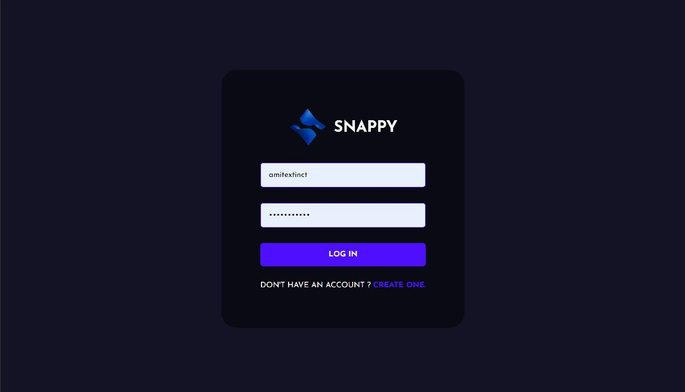

# SNAPPY

Simple Chat Application made using Mern stack


## Screenshots




## Installation

make sure you have npm installed in your system

cd to your desired location and then clone this repository using 
```bash
  https://github.com/amitextinct/Snappy.git
```
then edit the url of your Mongodb database in the .env file in server folder

run the server using the npm start
```bash
cd server
npm start
```
now cd to the public folder and run the react App

```bash
cd ..
cd public
yarn start
```
App should be running on localhost:3000
